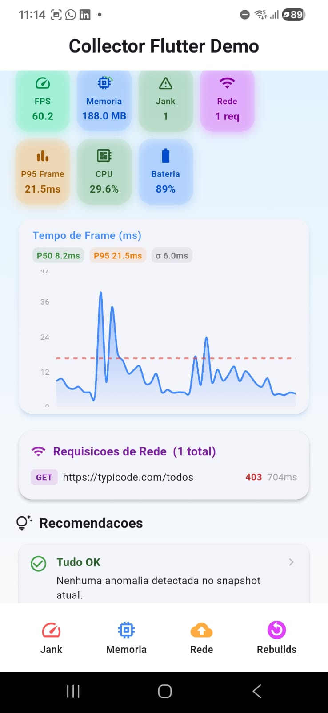
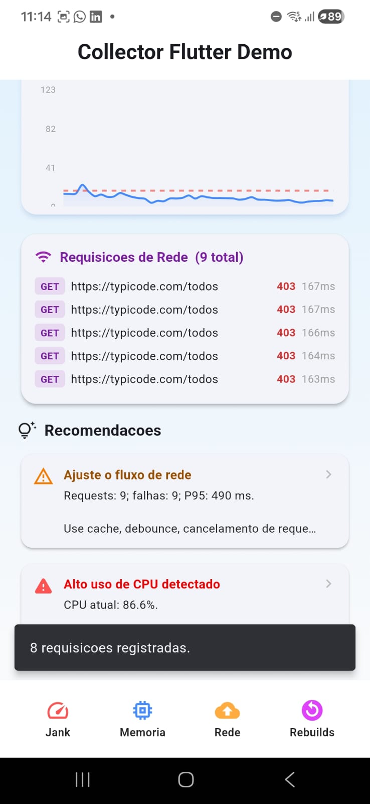
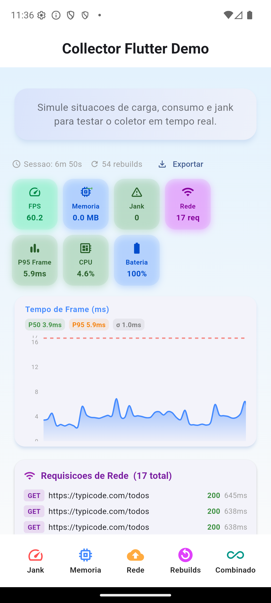
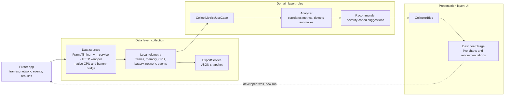

<div align="center">

# collector_flutter

**In-app performance monitoring for Flutter.** FPS and jank percentiles, memory, CPU, battery, HTTP traffic and widget rebuilds, with a live dashboard and actionable recommendations, all running inside the app.

[](https://pub.dev/packages/collector_flutter)
[](https://pub.dev/packages/collector_flutter/score)
[](https://github.com/BeatrizVocurcaFrade/collector_flutter/actions/workflows/ci.yml)
[](collector_flutter/LICENSE)

</div>

<table>
  <tr>
    <td align="center"></td>
    <td align="center"></td>
    <td align="center"></td>
  </tr>
  <tr>
    <td align="center"><sub>Live metrics and frame-time chart</sub></td>
    <td align="center"><sub>Recommendations when issues are detected</sub></td>
    <td align="center"><sub>Stress scenarios in the demo app</sub></td>
  </tr>
</table>

This repository contains the package and the undergraduate thesis behind it: ***Monitoring and Optimizing Resource Consumption in Flutter Apps***, Systems Engineering, Federal University of Minas Gerais (UFMG), advised by Prof. Ramon Lacerda Marques.

## Why

Profilers like DevTools, Android Studio Profiler and Xcode Instruments are powerful, but they run outside the app. You have to attach them, and they are hard to keep running on real devices, in QA sessions or in a classroom. `collector_flutter` embeds the monitoring in the app itself. It needs no backend, works offline and keeps overhead low, and it goes beyond showing numbers: it explains what to fix.

## Features

- **Frame timing:** FPS, jank detection, P50 / P95 / P99 percentiles and variance.
- **Memory:** RSS and heap usage through the Dart VM Service, with a fallback outside profile mode, plus trend in MB/min.
- **CPU and battery:** a native bridge in Kotlin and Swift, over a `MethodChannel`.
- **HTTP traffic:** request count, latency, payload size and failure rate through a transparent client wrapper.
- **Custom events and widget rebuilds:** manual tracking or the `RebuildObserver` wrapper.
- **Heuristic analysis:** detects frame drops, memory pressure, network anomalies and rebuild storms.
- **Recommendations:** severity-coded suggestions (info / low / medium / high), each with an explanation.
- **Embedded dashboard:** `DashboardPage` with live charts, metric cards, a network panel and JSON export.

## Quick start

```yaml
dependencies:
  collector_flutter: ^0.1.3
```

```dart
import 'package:collector_flutter/collector_flutter.dart';

final collector = ResourceCollector(
  collectionInterval: const Duration(seconds: 2),
  budget: const PerformanceBudget(targetFrameRate: 60),
);

await collector.start();

// Instrument HTTP calls
final response = await collector.network.get(Uri.parse('https://api.example.com/data'));

// Record custom events
collector.recordEvent('checkout_started', {'cart_items': 3});

// Open the dashboard
Navigator.push(
  context,
  MaterialPageRoute(builder: (_) => DashboardPage(collector: collector)),
);
```

> Run in **profile mode** (`flutter run --profile`) for accurate memory readings from the VM Service.

The full API reference is in the [package README](collector_flutter/README.md) and on [pub.dev](https://pub.dev/packages/collector_flutter).

## Architecture

The package follows **Clean Architecture** in three layers:



## Demo app

[`collector_flutter/example`](collector_flutter/example) is a demo app that embeds the dashboard and adds five stress scenarios, so you can watch the collector react in real time:

| Scenario | What it does |
|---|---|
| **Jank** | Bursts of 90 ms busy-loops on the UI thread |
| **Memory** | Allocates 4 × 32 MB, then releases it after 3 s |
| **Network** | 8 parallel GET requests through the instrumented client |
| **Rebuilds** | 30 forced widget rebuilds |
| **Combined** | All of the above at once |

## Quality

- **60 unit tests** covering the analyzer, recommender, CPU/battery handling and JSON export.
- `flutter analyze` and `dart format` run clean. CI runs analyze, format and tests on every push and pull request.
- **150 / 160 pub points** on pub.dev, MIT licensed.

## Repository layout

| Path | Contents |
|---|---|
| [`collector_flutter/`](collector_flutter) | The package: Dart sources, native Android/iOS bridge, tests and the demo app |
| [`tcc/`](tcc) | Thesis in LaTeX ([`Monografia.pdf`](tcc/Monografia.pdf)) |
| [`slides/`](slides) | Defense slides in Beamer ([`main.pdf`](slides/main.pdf)) |
| [`ponto_controle_tcc2/`](ponto_controle_tcc2) | Thesis checkpoint report |
| [`images/`](images) | Figures and Mermaid diagrams used in the thesis |

## License

[MIT](collector_flutter/LICENSE) © Beatriz Vocurca Frade
